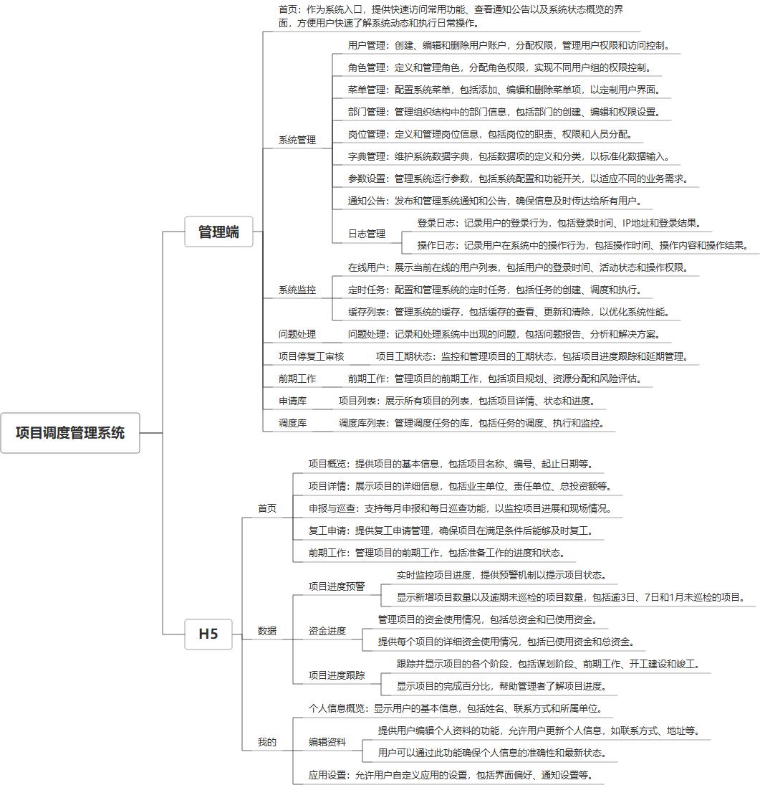

 

    
 

公司拥有上百套具有自主知识产权的软件系统，详情请查看码云首页或公司官网

 
<h1>项目调度管理系统</h1>

<a href="https://www.haishi.net.cn/">公司官网</a> ｜ <a href="https://www.haishi.net.cn/">在线体验</a>

 

## 系统介绍

发改委项目调度管理系统是一款面向政府发改委部门的项目管理平台，它集成了项目申报、联防配置、业主信息管理、值班安排、巡检记录、工单处理、用地管理、用户角色权限控制等多个功能模块，支持项目从规划、实施到验收的全过程管理，同时提供数据监控、服务监控、调度库管理、资金情况监控等工具，旨在提升项目执行效率，确保项目进度和质量，实现项目管理的规范化和信息化。
发改委项目调度管理系统是一款面向政府发改委部门的项目管理平台，它集成了项目申报、联防配置、业主信息管理、值班安排、巡检记录、工单处理、用地管理、用户角色权限控制等多个功能模块，支持项目从规划、实施到验收的全过程管理，同时提供数据监控、服务监控、调度库管理、资金情况监控等工具，旨在提升项目执行效率，确保项目进度和质量，实现项目管理的规范化和信息化。
本项目名称为项目调度管理系统，用于管理项目调度相关的各项工作。系统涵盖登录系统、首页、系统管理、系统监控、问题处理、项目停复审核、前期工作、申请库和调度库等模块，实现了对用户、角色、菜单、部门、通知公告、日志、在线用户、定时任务、项目工期状态、项目列表、调度列表等信息的综合管理。该系统旨在提高项目调度效率，优化资源配置，并对项目进度进行实时监控和管理。
                

## 系统功能介绍

### 系统包含终端说明

管理端（WEB）、用户端（Android APP）

| 序号 | 模块 | 模块说明 |
| --- | --- | --- |
| 1 | ZF-PMS-FGW-H5 | H5端 |
| 2 | ZF-PMS-FGW-SERVER | 服务端 |
| 3 | ZF-PMS-FGW-MANAGE | 管理端 |

### 系统功能结构

### 系统功能说明

系统主要功能：
- 登录系统：提供用户登录功能。
- 首页：系统首页，展示概览信息。
- 系统管理：包含用户管理、角色管理、菜单管理、部门管理、通知公告和日志管理等功能，用于维护系统基础数据和信息。
- 系统监控：包含在线用户和定时任务监控，实时掌握系统运行状态。
- 问题处理：处理项目执行过程中遇到的问题。
- 项目停复审核：对项目的暂停和恢复进行审核。
- 前期工作：管理项目前期准备工作。
- 申请库：管理项目申请信息。
- 调度库：管理项目调度信息，包含调度列表。
核心功能：
- 项目调度：对项目进行调度，安排资源和时间，并跟踪进度。
- 项目监控：实时监控项目执行情况，及时发现和处理问题。
- 用户权限管理：对不同用户分配不同的权限，保证系统安全和数据可靠性。
- 项目停复审核：对项目的暂停和恢复进行审核，控制项目流程。

## 系统主要界面

## 系统技术说明

### 代码模块说明

| 序号 | 目录 | 目录说明 |
| --- | --- | --- |
| 1 | ZF-PMS-FGW-SERVER/project-manager-framework | -- |
| 2 | ZF-PMS-FGW-SERVER/project-manager-admin | -- |
| 3 | ZF-PMS-FGW-SERVER/project-manager-common | -- |
| 4 | ZF-PMS-FGW-SERVER/project-manager-system | -- |
| 5 | ZF-PMS-FGW-SERVER/project-manager-generator | -- |
| 6 | ZF-PMS-FGW-SERVER/project-manager-quartz | -- |
| 7 | ZF-PMS-FGW-SERVER/.idea | -- |

### 系统技术选型

#### 开发语言/框架

JAVA（JDK1.8）
前端框架：VUE2

#### 服务中间件

Nginx
Tomcat

#### 数据库

MySQL（5.7+）

#### 其他说明

无

## 系统演示/商用

请扫码添加客服微信获取演示地址和系统详细资料。

如果您想基于项目调度管理系统进行商业化交付或定制开发服务，我们提供有偿的技术服务支持，合作模式不限，欢迎沟通！

公司官网地址： <a href="https://www.haishi.net.cn/">https://www.haishi.net.cn</a>

联系客服获取专业回答。

## 使用须知

1、 本项目商用必须获得版权所有者的授权。

2、 未经允许本项目代码不允许二次出售。

